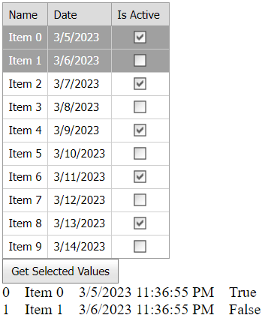

<!-- default badges list -->
[](https://supportcenter.devexpress.com/ticket/details/E319)
[](https://docs.devexpress.com/GeneralInformation/403183)
<!-- default badges end -->
# Grid View for ASP.NET Web Forms - How to get column values of multiple selected rows.

<!-- run online -->
**[[Run Online]](https://codecentral.devexpress.com/e319/)**
<!-- run online end -->

This example demonstrates how to use the server-side [GetSelectedFieldValues](https://docs.devexpress.com/AspNet/DevExpress.Web.ASPxGridBase.GetSelectedFieldValues(System.String--)) method to obtain field values of multiple selected rows.



## Overview

Follow the steps below:

1. Set the grid's [AllowSelectByRowClick](https://docs.devexpress.com/AspNet/DevExpress.Web.ASPxGridViewBehaviorSettings.AllowSelectByRowClick) property to `true` to enable row selection.

    ```cs
    protected void Page_Init(object sender, EventArgs e) {
        // ...
        ASPxGridView1.SettingsBehavior.AllowSelectByRowClick = true;
        // ...
    }
    ```
2. In a button's `Click` event handler, call the `GetSelectedValues` function. In this function, get the field names of grid columns and call the [GetSelectedFieldValues](https://docs.devexpress.com/AspNet/DevExpress.Web.ASPxGridBase.GetSelectedFieldValues(System.String--)) method to obtain the field values of selected rows.

    ```cs
    protected void ASPxButton1_Click(object sender, EventArgs e) {
        GetSelectedValues();
        // ...
    }

    List<object> selectedValues;

    private void GetSelectedValues() {
        List<string> fieldNames = new List<string>();
        foreach(GridViewColumn column in ASPxGridView1.Columns)
            if(column is GridViewDataColumn)
                fieldNames.Add(((GridViewDataColumn)column).FieldName);
        selectedValues = ASPxGridView1.GetSelectedFieldValues(fieldNames.ToArray());
    }
    ```

## Files to Review

* [Default.aspx](./CS/GetSelectedValuesAllColumns/Default.aspx) (VB: [Default.aspx](./VB/GetSelectedValuesAllColumns/Default.aspx))
* [Default.aspx.cs](./CS/GetSelectedValuesAllColumns/Default.aspx.cs) (VB: [Default.aspx.vb](./VB/GetSelectedValuesAllColumns/Default.aspx.vb))

## Documentation

* [Grid Selection](https://docs.devexpress.devx/AspNet/3737/components/grid-view/concepts/focus-and-navigation/selection)
* [AllowSelectByRowClick](https://docs.devexpress.com/AspNet/DevExpress.Web.ASPxGridViewBehaviorSettings.AllowSelectByRowClick)
* [GetSelectedFieldValues](https://docs.devexpress.com/AspNet/DevExpress.Web.ASPxGridBase.GetSelectedFieldValues(System.String--))
